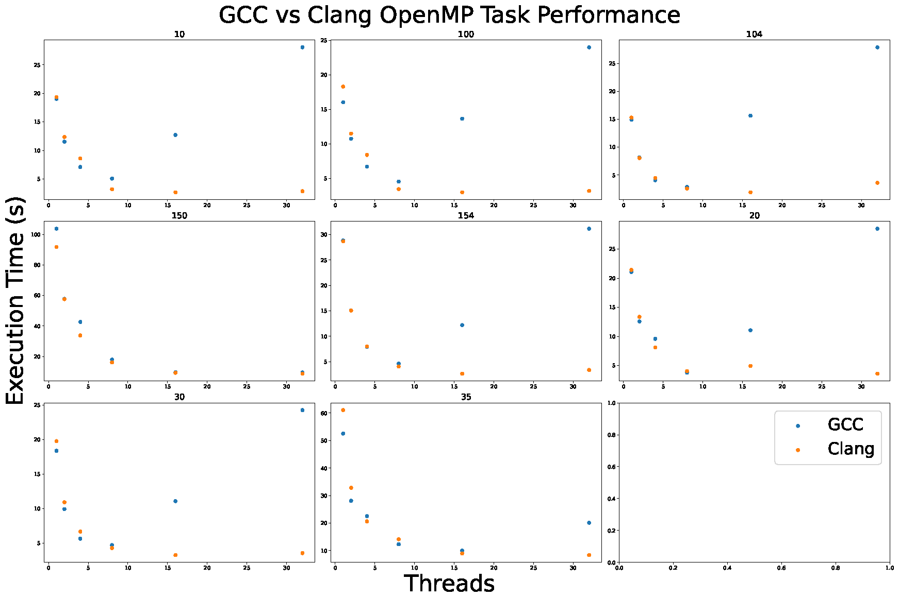

Compiler Performance
====================

### Quick Recommendations

Regardless of compiler, at a minimum we recommend having the numbers of ports and numbers of threads match as a minimum, so 4 threads when processing 4 ports of data.

If using GCC, we recommend matching the number of threads to the number of inputs ports of data.

If using Clang, we reccomend using the number of theads available in the execution NUMA node when no other processing is taking place. Otherwise, we recommend using twice as many threads as ports of data are being processed.

### Overview

While we aim to support the most popular compilers, we have noted that there is a sigificant performance delta in the library when compared the runtime performance of some GCC compiled artefacts and LLVM compiled artefacts, which is traced primarily down to the performance of their respective OpenMP implementations.

To accellerate the data reforming process, we use both `parallel for` loops and `tasks` in order to offload work across multiple threads in a thread-safe manner. While the performance of the `parallel for` loops does not seem to have a significant difference between the two compilers, OpenMP `task` calls are found to have a performance ceiling on GCC that are lower than that of LLVM, and show significant slowdown as more threads are made available at runtime.

### Observed performance

The following tests were performed with GCC 10.3.0 and Clang 12.0.0 on Ubuntu 22.04 on an Intel Xeon Gold 6130 CPU @ 2.10GHz (16 core, 32 thread). We generated multiple different types of outputs for a 60-second observation, with the command
```shell
lofar_udp_extractor -i ../20230418181951B0834+06/udp_1613[[port]].ucc1.2023-04-18T18\:20\:00.000.zst -p ${procmode} -o ./debug_[[idx]] -T ${threads} | tee ${compiler}_T${threads}_${procmode}
```

Testing both compilers for 1, 2, 4, 8, 16 and 32 threads both with OpenMP tasks enabled and disabled, we generate the following figure of execution speed (this is only the compute step, no I/O):



While the absolute values will change machine-to-machine (we are typically limited by the available memory bandwidth at high thread counts), the inability for GCC to scale to higher core counts without having performance regressions has been observed on 3 different high-core-count machines. While some processing modes do not show the same scaling behaviour, it is present in the majority of the Stokes outputs. Consequently, we reccomend the use of the LLVM ecosystem for compiling this library.

